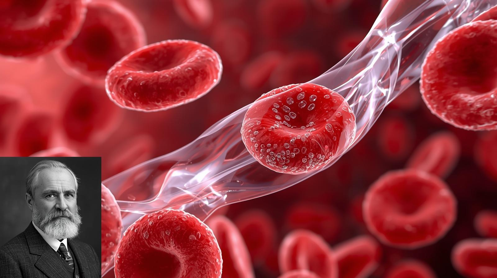
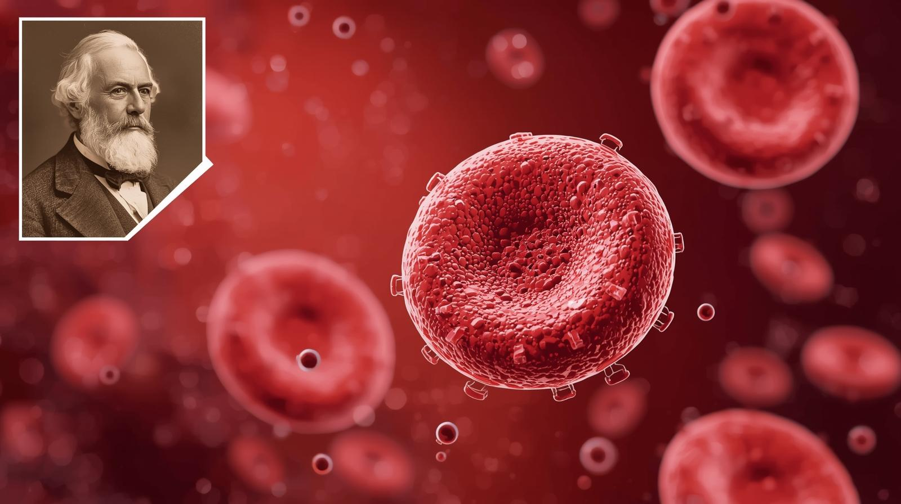
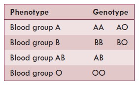
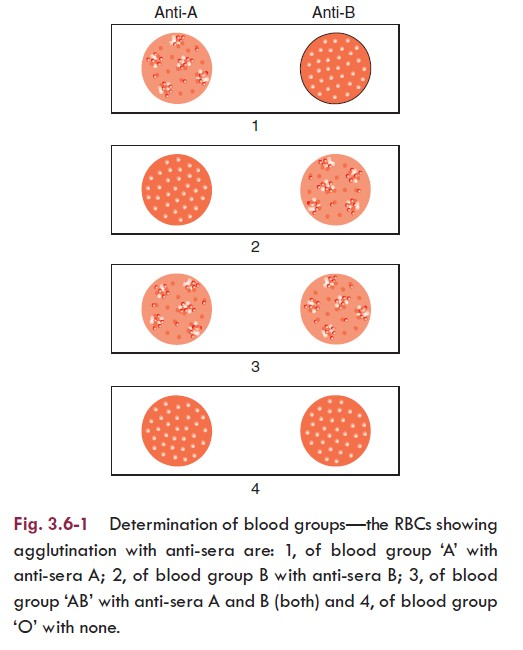
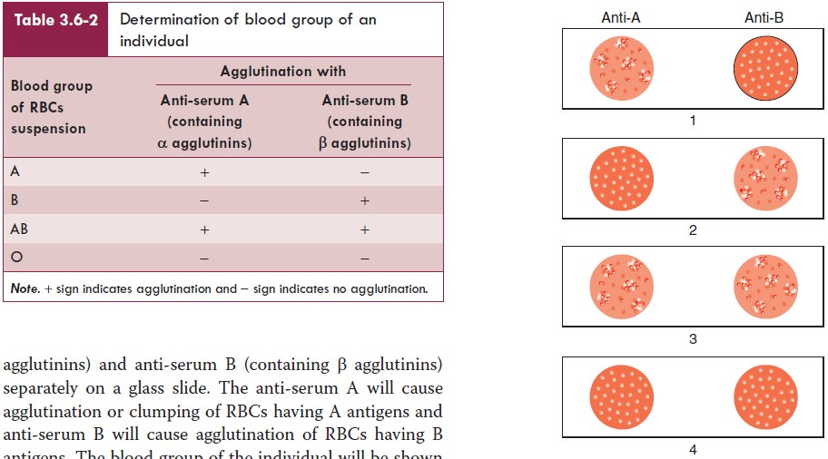
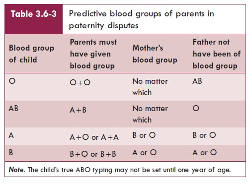

<!DOCTYPE html>
<html lang="en">
<head>
    <meta charset="UTF-8">
    <meta name="viewport" content="width=device-width, initial-scale=1.0">
    <title>Blood Groups and Blood Transfusion</title>
    
</head>
<body>

    

        

            

                <h2>❤ Blood Groups and Blood Transfusion</h2>
                
Welcome to this presentation on the blood groups and blood transfusion. This knowledge is essential for every dental and medical professional, especially when dealing with surgical procedures, trauma care, and emergency medicine.

                
This presenation was created by Dr Khin Soe.

				

            

            

                
            

        

		
		

            

                <h2>❤ Agglutinogens and agglutinins</h2>
                
Agglutinogens refer to the antigens present on the cell membranes of red blood cells (RBCs).

                
Agglutinins refer to the antibodies against the agglutinogens. These are present in the plasma.

				

            

            

                
            

        

		
		

            

                <h2>Agglutination of RBCs</h2>
                
Agglutination of RBCs can be caused by the antigens present on their cell membranes in the presence of suitable agglutinins (antibodies).

                
That is why these antigens are called agglutinogens.

				

            

            

                
            

        

		
		

            

                <h2>Landsteiner law</h2>
                
Karl Landsteiner in 1900 framed a law in relation to agglutinogens and agglutinins, which states that:

                
1. If an agglutinogen is present on the red cell membrane of an individual, the corresponding agglutinin must be absent in the plasma.

				

            

            

                
            

        

		
		

            

                <h2>Landsteiner law</h2>
                
2. If an agglutinogen is absent from the cell membrane of RBCs of an individual, the corresponding agglutinin must be present in the plasma.

                

				

            

            

                
            

        

		
		

            

                <h2>CLASSICAL ABO BLOOD GROUPING SYSTEM</h2>
                
The classical ABO blood grouping system is based on the presence of A and B agglutinogens on the cell membrane of RBCs.

                

				

            

            

                
            

        

		
		

            

                <h2>A AND B AGGLUTINOGENS</h2>
                
A and B agglutinogens are complex oligosaccharides differing in their terminal sugars.

                

				

            

            

                
            

        

		
		

            

                <h2>ANTI-A AND ANTI-B AGGLUTININS</h2>
                
Anti-A (or α) agglutinin and anti-B (or β) agglutinin refer to the antibody, i.e. which reacts with or acts on the antigen A and antigen B, respectively.

                

				

            

            

                
            

        

		
		

            

                <h2>ANTI-A AND ANTI-B AGGLUTININS</h2>
                
There are two types of α agglutinins: the α1 and α proper.

                
The α and β agglutinins are globulins of IgM type and cannot cross the placenta.

				

            

            

                
            

        

		
		

            

                <h2>ANTI-A AND ANTI-B AGGLUTININS</h2>
                
The α and β agglutinins act best at low temperature (5–20°C) and are therefore also called as cold antibodies.

                

				

            

            

                
            

        

		
		

            

                <h2>Blood group A</h2>
                
Blood group A is characterized by:

                
Presence of A agglutinogen and absence of B agglutinogen on the cell membrane of RBCs and

				
Presence of anti-B agglutinin and absence of anti-A agglutinin from the plasma.

            

            

                
            

        

		
		

            

                <h2>Blood group B</h2>
                
Blood group B is characterized by:

                
Presence of B agglutinogen and absence of A agglutinogen on the cell membrane of RBCs and

				
Presence of anti-A agglutinin and absence of anti-B agglutinin from the plasma.

            

            

                
            

        

		
		

            

                <h2>Blood group AB</h2>
                
Blood group AB is characterized by:

                
Presence of both A and B agglutinogens on the cell membrane of RBCs, and

				
Absence of both anti-A and anti-B agglutinins from the plasma.

            

            

                
            

        

		
		

            

                <h2>Blood group O</h2>
                
Blood group O is characterized by:

                
Absence of both A and B agglutinogens on the red cell membrane and, 

				
Presence of both anti-A and anti-B agglutinins in the plasma.

            

            

                
            

        

		
		

            

                <h2>INHERITANCE OF ABO BLOOD GROUPS</h2>
                
Agglutinogens A and B or the non-antigenic substances which determine the blood groups are genetically inherited as Mendelian dominant in the classical Mendelian pattern.

                

				

            

            

                
            

        

		
		

            

                <h2>DETERMINATION OF ABO BLOOD GROUPS</h2>
                

                

				

            

            

                
            

        

		
		

            

                <h2>DETERMINATION OF ABO BLOOD GROUPS</h2>
                
The ABO blood group of an individual can be determined by mixing one drop of suspension of the red cells (in isotonic saline) with a drop each of anti-serum A and anti-serum B separately on a glass slide.

                

				

            

            

                
            

        

		
		

            

                <h2>RHESUS (Rh) BLOOD GROUPING SYSTEM</h2>
                
The antigens responsible for Rh blood grouping system are called Rh antigens or Rh agglutinogens or Rh factor because these were first discovered in the RBCs of rhesus monkeys.

                

				

            

            

                
            

        

		
		

            

                <h2></h2>
                
Three types of Rh antigens, viz. C, D and E have been recognized. However, D antigen is commonest and produces worst transfusion reactions.

                
Therefore, for all practical purposes the term Rh antigen refers to D antigen.

				

            

            

                
            

        

		
		

            

                <h2>Rh ANTIBODIES</h2>
                
Rh antibodies (also called anti-D) are produced only when an Rh −ve individual is transfused with Rh +ve blood

                

				

            

            

                
            

        

		
		

            

                <h2></h2>
                
When a Rh −ve mother gives birth to Rh +ve baby (Rh +ve RBCs of fetus enter into the maternal circulation), Rh antibodies are of IgG type and can cross the placenta.

                

				

            

            

                
            

        

		
		

            

                <h2></h2>
                
Since these react best at body temperature so are also called warm antibodies.

                
Once produced, the Rh antibodies persist in the blood for years and can produce serious reactions during the second transfusion.

				

            

            

                
            

        

		
		

            

                <h2>Mechanism of haemolytic disease of newborn in Rh incompatibility</h2>
				<h3>1. Entrance of Rh +ve fetal RBCs into Rh −ve mother’s circulation during first pregnancy.</h3>
                
When a Rh −ve mother (genotypes dd) bears a Rh +ve child (genotype Dd) with father being Rh +ve (genotype DD or Dd) at the time of delivery, the fetal RBCs enter maternal circulation because of severance of umbilical cord.

                

				

            

            

                
            

        

		
		

            

                <h2>Mechanism of haemolytic disease of newborn in Rh incompatibility</h2>
				<h3>1. Entrance of Rh +ve fetal RBCs into Rh −ve mother’s circulation during first pregnancy.</h3>
                
Before delivery, usually the fetal and maternal circulation do not mix. Since the Rh +ve RBCs enter maternal circulation during delivery, so the first child is usually normal.

                

				

            

            

                
            

        

		
		

            

                <h2>Mechanism of haemolytic disease of newborn in Rh incompatibility</h2>
				<h3>2. Production of Rh antibodies (anti-D) in mother.</h3>
                
During postpartum period, i.e. within a month after delivery, the mother develops Rh antibodies in her blood.

                

				

            

            

                
            

        

		
		

            

                <h2>Mechanism of haemolytic disease of newborn in Rh incompatibility</h2>
				<h3>3. Rh incompatibility reaction during second pregnancy.</h3>
                
When the Rh −ve mother in the second pregnancy also bears a Rh +ve child, the Rh antibodies present in the mother’s blood enter the fetal circulation by crossing the placental barrier and cause agglutination of fetal RBCs leading to haemolytic disease of newborn.

                

				

            

            

                
            

        

		
		

            

                <h2>Manifestations of haemolytic disease of newborn</h2>
				<h3></h3>
                
Depending upon the severity, the haemolytic disease of newborn may manifest as Erythroblastosis fetalis.

                

				

            

            

                
            

        

		
		

            

                <h2>1. Erythroblastosis fetalis.</h2>
				<h3>Erythroblastosis</h3>
                
Erythroblastosis fetalis is characterized by appearance of large number of erythroblasts in the peripheral blood occurs as the haemopoietic tissue of the baby attempts to rapidly replace the haemolysed RBCs.

                

				

            

            

                
            

        

		
		

            

                <h2>1. Erythroblastosis fetalis.</h2>
				<h3>Anaemia</h3>
                
Anaemia occurs due to excessive haemolysis of RBCs by Rh antibodies. Infant may even die of severe anaemia.

                

				

            

            

                
            

        

		
		

            

                <h2>2. Icterus gravis neonatorum.</h2>
				<h3></h3>
                

                
Jaundice may occur within 24 h of birth due to excessive formation of bilirubin as a result of excessive haemolysis of RBCs.

				
Liver and spleen are enlarged.

            

            

                
            

        

		
		

            

                <h2>3. Kernicterus</h2>
				<h3></h3>
                
Kernicterus is a neurological syndrome occurring in newborns with severe haemolysis.

                
The excessive bilirubin formed may enter the brain tissue as the blood–brain barrier is not well developed in infants and cause damage.

				

            

            

                
            

        

		
		

            

                <h2>4. Hydrops fetalis</h2>
				<h3></h3>
                
Hydrops fetalis is a condition which the fetus is grossly oedematous. It occurs when haemolysis is very severe.

                
Usually, there occurs intrauterine death of fetus or if born prematurely or even at term, the infant dies within a few hours.

				

            

            

                
            

        

		
		

            

                <h2>Prevention of haemolytic disease of newborn</h2>
				<h3></h3>
                
The haemolytic disease in the newborn during second pregnancy can be prevented by injecting single dose of Rh antibodies (anti-D) in the form of Rh-immunoglobulin to mother soon after child birth.

                

				

            

            

                
            

        

		
		

            

                <h2>Treatment of haemolytic disease of newborn</h2>
				<h3></h3>
                
Treatment of haemolytic disease of the newborn is replacement of baby’s Rh +ve blood with Rh −ve blood exchange transfusion.

                

				

            

            

                
            

        

		
		

            

                <h2>CLINICAL APPLICATIONS OF BLOOD GROUPING</h2>
				<h3></h3>
                
1. In blood transfusion.

                
2. In preventing haemolytic disease in newborn.

				
3. In paternity disputes.

				
4. In medicolegal cases and

				
5. In knowing susceptibility to diseases.

            

            

                
            

        

		
		

            

                <h2>BLOOD TRANSFUSION</h2>
				<h3>INDICATIONS</h3>
                
Common situations in which blood transfusion is indicated are Blood loss, for quick restoration of haemoglobin, exchange transfusion, blood diseases and acute poisoning.

                

				

            

            

                
            

        

		
		

            

                <h2>BLOOD TRANSFUSION</h2>
				<h3>DONOR AND RECIPIENT</h3>
                
Donor refers to a person who donates the blood and the person who receives blood is a recipient.

                

				

            

            

                
            

        

		
		

            

                <h2>BLOOD TRANSFUSION</h2>
				<h3>AUTOLOGOUS BLOOD TRANSFUSION</h3>
                
Autologous blood transfusion refers to transfusion of an individual’s own blood which has been withdrawn and stored. Autologous transfusion is done under the following situations:

                
For elective surgery,

				
During surgery,and Some sports persons.

            

            

                
            

        

        

            

                <h2>Thank You for Watching.</h2>
                

                

            

            

                
            

        

        

    

        <button id="prev-btn" disabled>← Previous</button>
        <button id="tts-btn">▶ Play Narration</button>
        <button id="next-btn">Next →</button>
        <button id="fullscreen-btn">⤡ Fullscreen</button>
    

    
</body>
</html>

